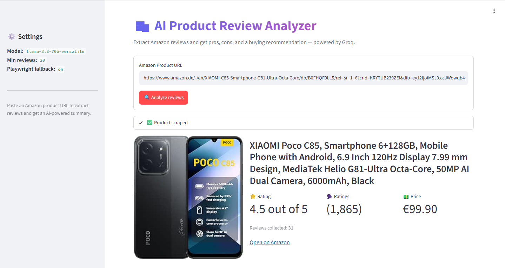
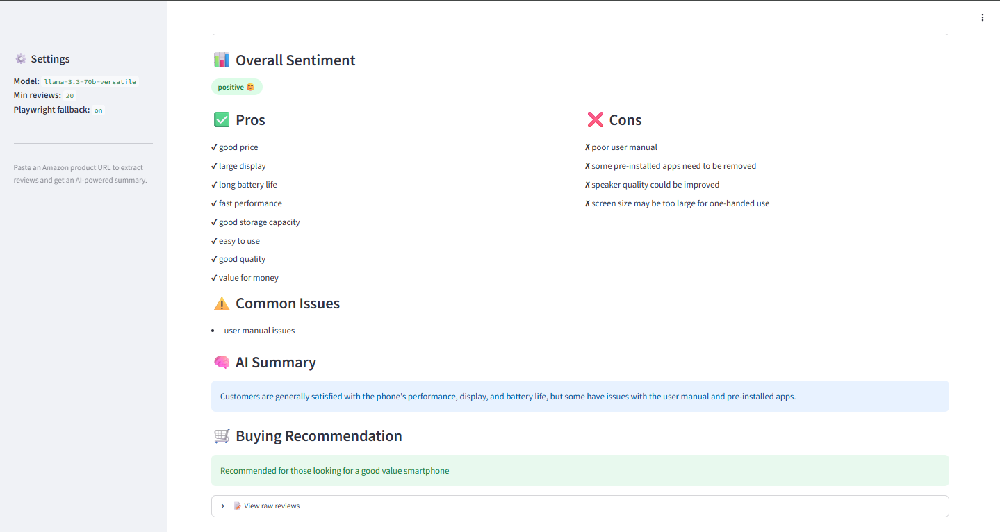

# 🛍️ AI Product Review Analyzer

A minimal, production-style **MVP** that turns any Amazon product URL into a
clean AI-generated review report — pros, cons, common issues, an overall
sentiment score, and a buying recommendation.

Built with **Python + Streamlit + Groq LLM**.

---

## Features

- **Paste an Amazon URL** — no manual data entry required.
- **Smart scraping** — fast static parsing with `requests` + `BeautifulSoup`,
  automatic **Playwright** fallback when the page requires JavaScript.
- **Review cleaning** — deduplication, whitespace normalization, and
  short-review filtering.
- **LLM analysis** via the **Groq API** — pros, cons, common issues,
  concise summary, and buying recommendation.
- **Streamlit dashboard** — product header, sentiment badge, pros/cons
  columns, and a raw-reviews explorer.
- **Robust error handling** — invalid URLs, blocked pages, missing
  reviews, and Groq API errors are all surfaced with friendly messages.

---

## Architecture

```
┌──────────────┐        ┌────────────┐        ┌───────────────┐        ┌──────────────┐
│  Streamlit   │  URL   │  scraper   │ reviews│   analyzer    │  text  │  groq_client │
│  (app.py)    ├───────►│ (BS4 + PW) ├───────►│ (clean+build) ├───────►│  (LLM call)  │
└──────┬───────┘        └────────────┘        └───────────────┘        └──────┬───────┘
       │                                                                        │
       │◄──────────────────────── JSON analysis ────────────────────────────────┘
       │
       ▼
   Rendered dashboard
```

| Module           | Responsibility                                              |
| ---------------- | ----------------------------------------------------------- |
| `config.py`      | Env loading, settings dataclass, logging                    |
| `scraper.py`     | Fetch page (requests → Playwright), parse product & reviews |
| `analyzer.py`    | Clean, deduplicate, and build the LLM prompt block          |
| `groq_client.py` | Call Groq, extract JSON, validate schema                    |
| `app.py`         | Streamlit UI, orchestration, error surfaces                 |

---

## Installation

```bash
# 1. Clone
git clone <your-repo-url> ai-product-review-analyzer
cd ai-product-review-analyzer

# 2. (Recommended) create a virtual environment
python -m venv .venv
source .venv/bin/activate      # Windows: .venv\Scripts\activate

# 3. Install dependencies
pip install -r requirements.txt

# 4. (Optional) install Playwright browsers for the JS fallback
playwright install chromium
```

---

## Environment Setup

Create a `.env` file at the project root:

```env
GROQ_API_KEY=your_groq_api_key_here

# Optional
GROQ_MODEL=llama-3.3-70b-versatile
GROQ_TEMPERATURE=0.2
GROQ_MAX_TOKENS=1500
MIN_REVIEWS=20
REQUEST_TIMEOUT=20
USE_PLAYWRIGHT_FALLBACK=true
```

Get a free Groq API key at **[console.groq.com](https://console.groq.com)**.

---

## How to Run

```bash
streamlit run app.py
```

Then open **http://localhost:8501**, paste an Amazon product URL, and click
**Analyze reviews**.

---

## Screenshots

```



```

---

## System Prompt

The LLM is instructed to return **strict JSON** with the following shape:

```json
{
  "overall_sentiment": "",
  "pros": [],
  "cons": [],
  "common_issues": [],
  "summary": "",
  "recommendation": ""
}
```

---

## Tech Stack

- **Python**
- **Streamlit** — dashboard UI
- **requests / BeautifulSoup4** — static HTML scraping
- **Playwright** — JS-rendered fallback
- **Groq SDK** — Llama 3.3 70B inference
- **python-dotenv** — environment management
